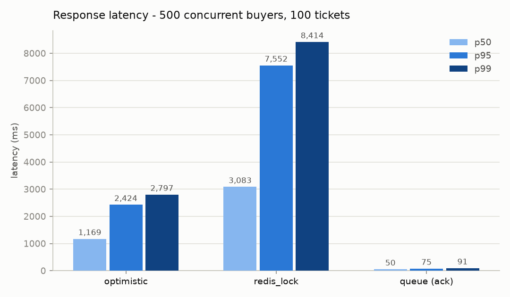
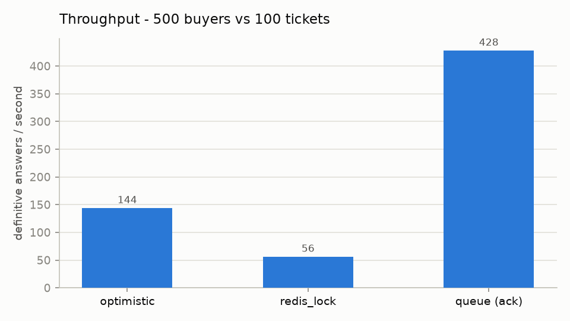
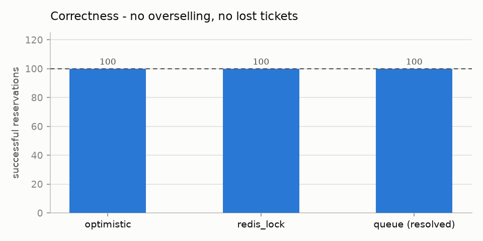

# ConcurrenSeat

[](https://github.com/harshues04/ConcurrenSeat/actions/workflows/ci.yml)

A concurrency-safe flash-sale ticket booking backend that implements the same
problem three ways — **optimistic locking**, a **Redis distributed lock**, and a
**queue-based waiting room** — and benchmarks them against each other under a
500-buyers-vs-100-tickets stampede.

**The invariant everything is judged against:** firing 500 concurrent purchase
attempts at 100 tickets must produce *exactly* 100 reservations — never more
(overselling), never fewer (lost inventory) — with no ticket assigned twice,
and duplicate/retried requests never consuming extra tickets.

> **Live demo:** _deploy pending — see [Deployment](#deployment)_. Until then:
> [Run locally](#running-locally).

## Why this is hard

A ticket sale is a race by construction: one row of inventory, thousands of
buyers arriving in the same second. The naive implementation —

```sql
SELECT tickets_remaining FROM events WHERE id = ?;   -- everyone reads 1
UPDATE events SET tickets_remaining = 0 ...;          -- everyone "wins"
```

— is a textbook *check-then-act* race: between the read and the write, someone
else already bought the ticket. Under real load this produces oversold events,
double-assigned seats, and double-charged customers. Fixing it is a
trade-off space, not a single answer, which is exactly what this project maps:
three strategies, one interface, identical correctness tests, measured
head-to-head.

## Architecture

```
                       ┌──────────────────────── FastAPI ───────────────────────┐
  React + TS (Vite)    │  POST /events/{id}/purchase      strategy registry     │
 ┌──────────────────┐  │       │            ┌──────────────┼──────────────┐     │
 │ event page       │──┼── HTTP┘            ▼              ▼              ▼     │
 │ buy button       │  │              optimistic      redis_lock        queue   │
 │ live queue pos ◄─┼──┼── WS /ws/queue/{id}  │            │              │     │
 │ FAQ widget       │  │                      │            │        ┌─────┴───┐ │
 └──────────────────┘  │                      │            │        │ worker  │ │
                       └──────────────────────┼────────────┼────────┼─────────┼─┘
                                              ▼            ▼        ▼         │
                       ┌────────────┐   ┌─────────────────────────────────┐   │
                       │  Postgres  │◄──┤ Redis: inventory gate, per-event│◄──┘
                       │  (truth)   │   │ lock, FIFO queue, pub/sub,      │
                       └────────────┘   │ result mailbox                  │
                                        └─────────────────────────────────┘
```

- **Postgres** holds the durable truth: `events`, `tickets` (with a `version`
  column), `reservations` (with a `UNIQUE idempotency_key`).
- **Redis** plays four roles depending on strategy: atomic inventory gate,
  distributed lock, FIFO waiting-room queue, and pub/sub channel that feeds the
  WebSocket.
- All three strategies implement one interface —
  `attempt_purchase(event_id, user_id, idempotency_key) -> ReservationResult` —
  and are swappable per-request via the `strategy` field (or `DEFAULT_STRATEGY`).

## The three strategies

### A. Optimistic locking (`strategies/optimistic_locking.py`)

No locks are held while deciding. Read a random available ticket and the
`version` you saw, then claim it with a conditional write:

```sql
UPDATE tickets SET status = 'reserved', version = version + 1
WHERE id = :id AND version = :version_we_saw
```

If a concurrent buyer got there first, their write bumped `version`, your
`WHERE` matches zero rows, and `rowcount == 0` tells you that you lost — without
blocking, and with no deadlock possible. Lost races retry up to 3 times with
full-jitter exponential backoff. Two details matter:

- **Random ticket selection**: if every buyer grabbed the *first* available
  row, all 500 would fight over one ticket and only one could win per round.
  Random spread means most buyers don't collide at all.
- **One transaction** claims the ticket, decrements `events.tickets_remaining`
  (in SQL, not read-modify-write), and inserts the reservation — so a crash
  can never leave a claimed ticket without a reservation.

### B. Redis distributed lock (`strategies/redis_distributed_lock.py`)

Contention is resolved in Redis *before* Postgres is touched:

1. **The gate** — a Lua script atomically checks-and-decrements a Redis-cached
   inventory counter (lazily initialized from Postgres with `SET NX`). Redis
   executes scripts atomically, so overselling is impossible at the gate, and
   the 400 losers cost one Redis round-trip each — no lock, no DB.
2. **The lock** — winners serialize the Postgres ticket assignment behind a
   per-event `SET NX PX` lock (TTL so a crashed holder can't deadlock the
   event) with a **token-checked release**: release only deletes the lock if it
   still holds *your* token, otherwise an expired holder would free the next
   buyer's lock.
3. **Compensation** — if Postgres fails after the gate granted a unit, the unit
   is `INCR`'d back so Redis inventory never leaks.

### C. Queue-based waiting room (`strategies/queue_waiting_room.py`)

Nobody races at all. Buyers `RPUSH` onto a per-event Redis list and immediately
get back *"queued, position N"* (~50ms). A worker `LPOP`s at a controlled
admission rate — the knob that shields Postgres during a spike — and executes
each purchase (delegating to strategy A, which faces almost no contention since
the queue spaced requests out). Results land in a TTL'd Redis mailbox keyed by
idempotency key; position changes are *pushed* to waiting buyers over
WebSocket. The unique property: **strict FIFO fairness** — the concurrency
suite asserts that outcomes in arrival order are exactly 100 successes followed
by 400 sold-outs. In A and B, thread-timing luck decides who wins; here,
arrival order does.

### Idempotency (all three)

Every purchase carries a client-generated idempotency key, held stable across
retries (the frontend keeps it in a ref until the purchase resolves). Two
layers enforce exactly-once:

1. A cheap pre-check returns the existing reservation for a repeated key.
2. The race-proof backstop: `reservations.idempotency_key` is `UNIQUE`, so if
   two calls with the same key race past the pre-check, Postgres rejects the
   second insert — and because the claim is one transaction, the rollback
   undoes the loser's ticket claim and counter decrement too (strategy B also
   returns its Redis gate unit).

Tested by firing the same key from 8 threads at once: one reservation row, one
ticket consumed.

## Benchmarks

500 concurrent buyers vs 100 tickets per strategy, in-process (measuring the
strategies, not HTTP), on a Windows dev machine with Dockerized Postgres 16 +
Redis 7. Correctness is asserted *inside* the benchmark — these are numbers for
implementations that provably don't oversell. Reproduce with
`python benchmarks/compare_strategies.py`.

| strategy | p50 | p95 | p99 | successes | throughput |
|---|---|---|---|---|---|
| optimistic | 1,169 ms | 2,424 ms | 2,797 ms | **100 / 100** | 144 answers/s |
| redis_lock | 3,083 ms | 7,552 ms | 8,414 ms | **100 / 100** | 56/s |
| queue (ack) | **50 ms** | 75 ms | 91 ms | **100 / 100** | 428 acks/s |
| queue (resolved) | 6,706 ms | 10,537 ms | 10,938 ms | **100 / 100** | 41/s |





### Trade-off discussion (what I'd actually pick, and when)

- **Optimistic locking** wins raw throughput and is the simplest to operate
  (no Redis dependency in the purchase path). Its cost scales with
  *contention*: every conflict burns a wasted transaction plus a retry. At
  500-vs-100 that's fine; at 50,000-vs-100 the DB does enormous wasted work.
  **Pick it when** oversell-safety matters but traffic is bounded — internal
  systems, mid-size on-sales.
- **Redis lock** looks worst in this single-node benchmark — the per-event lock
  serializes winners, so tail latency balloons (p95 ≈ 7.5s). But the benchmark
  *hides its virtue*: the 400 losers were rejected by one atomic Redis op each
  and never touched Postgres. The DB sees only ~100 writes regardless of
  whether 500 or 500,000 people show up. **Pick it when** the database is the
  resource you must protect and load is unbounded.
- **Queue waiting room** decouples *response* from *resolution*: buyers get an
  answer 20–60× faster than either direct strategy (50ms vs 1.2–3s p50), the
  admission rate caps DB load at a number you choose, and it's the only
  strategy with fairness guarantees. The price: winners learn their fate
  seconds later (worker-paced), and you now operate a worker + WebSocket
  infrastructure. **Pick it when** UX under extreme load matters — which is
  why real ticket vendors (Ticketmaster, Queue-it) all converge on waiting
  rooms for high-demand sales.

### Two bugs only load testing found

Both are committed as honest history — unit tests passed while both were live:

1. **Connection-pool deadlock**: the purchase endpoint held its request-scoped
   DB session across the strategy call, which opens its own sessions. Under 20
   concurrent requests every pooled connection was held by a request *waiting*
   for another connection — zero purchases completed in 10s of load. Fix:
   check-and-release before invoking the strategy.
2. **Redis pool exhaustion**: 500 threads spinning on `SET NX` blew through
   redis-py's default connection cap (`MaxConnectionsError`). Fix: explicit
   `max_connections` sized for burst traffic.

## Why WebSockets instead of polling

A queued buyer needs ~1 update per position change. Polling at 2s means a
10,000-person queue generates 5,000 requests/s of mostly-unchanged answers
against the very backend you're trying to protect. Instead, the worker
`PUBLISH`es after each admission; WebSocket handlers subscribe per-event and
push only *changes* (deduplicated server-side), with a terminal `resolved`
message carrying the outcome. Clients that can't hold a socket can still poll
`GET /reservations/{id}/status` as a fallback.

## The FAQ assistant

`POST /events/{id}/ask` answers visitor questions ("when does the sale start?",
"how does the queue work?") via the Anthropic API. Deliberately a widget, not a
chatbot:

- The **system prompt is static** (persona, scope rules, "never invent
  prices/policies") and volatile context — event name, sale time, *live*
  tickets-remaining, a short how-the-queue-works blurb — rides in the user
  turn, which is both prompt-injection hygiene and cache-friendly structure.
- Off-topic questions are politely refused by instruction; answers are capped
  at 2–4 sentences (`max_tokens=512`).
- Typed error handling: rate limits and outages map to 503 with friendly
  retry messages, other API failures to 502, missing key to a clean 503.
  Tests run against a mocked client, so CI needs no API key.

## Running locally

Prereqs: Docker, Python 3.12, Node 20.19+ (or 22 LTS).

```bash
docker compose up -d postgres redis      # infra (host ports 5433/6379)

cd backend
python -m venv venv && venv/Scripts/activate   # or source venv/bin/activate
pip install -r requirements.txt
cp ../.env.example ../.env               # defaults work for local dev
alembic upgrade head                     # create schema
python -m app.db.seed                    # demo event, 100 tickets → prints id
uvicorn app.main:app --reload            # API on :8000

cd ../frontend
npm install
npm run dev                              # UI on :5173
# open http://localhost:5173/?event=<seeded-event-id>
```

Note: the container's Postgres publishes on host port **5433** (not 5432) to
avoid colliding with a host-installed Postgres.

### Tests

```bash
cd backend
pytest tests/unit -q          # 58 tests: strategies, idempotency, API, WS
pytest tests/concurrency -q   # the 500-vs-100 races, all three strategies
pytest --cov=app              # coverage (~91%)
```

### Load testing & benchmarks

```bash
cd backend
python benchmarks/compare_strategies.py   # table + charts → data/results/

# HTTP-level spike (API must be running; seed an event first):
EVENT_ID=<uuid> STRATEGY=optimistic locust -f load_tests/locustfile.py \
    --headless -u 1000 -r 200 -t 60s -H http://localhost:8000
```

## Deployment

- **Backend (Render)**: *New → Blueprint* → point at this repo; `render.yaml`
  provisions the Dockerized API (running migrations on boot), Postgres, and a
  Key Value (Redis) instance. Set `ANTHROPIC_API_KEY` in the dashboard, then
  seed from the service shell: `python -m app.db.seed`.
- **Frontend (Vercel)**: import the repo, set root directory to `frontend/`,
  add `VITE_API_URL=<Render API URL>`. Then append the Vercel origin to the
  API's `CORS_ORIGINS` and redeploy.
- **CI (GitHub Actions)**: every push runs migrations plus the full unit and
  concurrency suites against real Postgres/Redis service containers, and
  lints/type-checks/builds the frontend on Node 22.

## Repo layout

```
backend/
  app/
    strategies/        # the three attempt_purchase implementations
    core/              # redis clients, idempotency
    routers/           # events, bookings, ws (queue positions), assistant
    ai/                # FAQ assistant (Anthropic API)
    models/ db/        # SQLAlchemy models, Alembic migrations, seed
  tests/
    unit/              # 58 tests, mocked where sensible
    concurrency/       # the 500-vs-100 invariant, per strategy
  load_tests/          # locust flash-sale spike
  benchmarks/          # compare_strategies.py → data/results/
frontend/              # Vite + React + TS: event page, WS queue position, FAQ
data/results/          # committed benchmark table + charts (embedded above)
```
